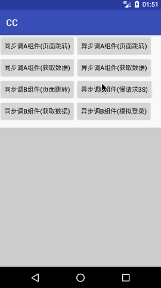

## CC : ComponentCaller

一句话介绍：一套基于组件总线的、支持渐进式改造的、支持跨进程调用的、完整的安卓组件化框架

- 基于组件总线： 
    - 不同于市面上种类繁多的路由框架，CC采用了基于组件总线的架构，不依赖于路由
- 支持渐进式改造： 
    - 可能是目前业界唯一（如果不是，请告诉我）支持渐进式改造的组件化框架
    - 模块解耦不再是前提，将陡峭的组件化改造实施曲线拉平
- 支持跨进程调用： 
    - 支持应用内跨进程调用组件，支持跨app调用组件
    - 调用方式与同一个进程内的调用方式完全一致
    - 无需bindService、无需自定义AIDL，无需接口下沉
- 完整：
    - CC框架下组件提供的服务可以是几乎所有功能，包括但不限于页面跳转、提供服务、获取数据、数据存储等
    - CC提供了配套插件cc-register，完成了自定义的组件类、全局拦截器类及json转换工具类的自动注册，
    - cc-register同时还提供了代码隔离、debug代码分离、组件单独调试等各种组件化开发过程中需要的功能

模块|CC|cc-register
---|---|---
最新版本| [](https://bintray.com/hellobilly/android/cc/_latestVersion)| [](https://bintray.com/hellobilly/android/cc-register/_latestVersion)


技术原理: [Wiki](https://github.com/luckybilly/CC/wiki)

[升级指南：从CC 1.x.x升级到CC 2.x.x](2.0升级指南.MD)

## 使用CC的理由

- 支持渐进式组件化改造 [强烈推荐：使用CC进行渐进式组件化改造](https://github.com/luckybilly/CC/wiki/%E4%BD%BF%E7%94%A8CC%E8%BF%9B%E8%A1%8C%E6%B8%90%E8%BF%9B%E5%BC%8F%E7%BB%84%E4%BB%B6%E5%8C%96%E6%94%B9%E9%80%A0)

        
        从集成CC的那一刻起，你的项目就已经组件化成功了：新业务即可以组件的形式开发
        未解耦的模块通过创建一个IComponent接口的实现类即可暴露服务给其它组件调用（通过CC可支持跨app的组件调用）
        有闲暇时再将模块解耦出来，以使其可以单独编译运行
        解耦只是过程，而不是前提
        点击上方强烈推荐的文章链接⬆了解详细的渐进式组件化概念
        
- 一静一动（开发时运行2个app，功能完整）
    - 静：主App (通过跨App的方式调用单组件App内的组件)
    - 动：单组件App (通过跨App的方式调用主App内的所有组件)
    - 通过这种方式让组件之间完全无需依赖，从源头解决代码隔离的问题
- 3种AOP策略助你随心所欲进行AOP编程
    - 静态拦截器（全局拦截器）、动态拦截器、组件内部onCall方法中拦截
- 对Push及jsBridge友好
    - 直接转发对组件的调用即可，与业务组件完全解耦，[参考demo](demo_component_jsbridge/src/main/java/com/billy/cc/demo/component/jsbridge/BridgeWebViewHelper.java)、[参考文章](https://github.com/luckybilly/CC/wiki/CC%E6%A1%86%E6%9E%B6%E5%AE%9E%E8%B7%B5(3):-%E8%AE%A9jsBridge%E6%9B%B4%E4%BC%98%E9%9B%85)
- 支持跨进程调用组件
    - 包括在app内部跨进程调用组件及开发阶段跨app调用组件（一静一动两个app相互调用对方的组件）


了解业界开源的一些组件化方案：[多个维度对比一些有代表性的开源android组件化开发方案](https://github.com/luckybilly/AndroidComponentizeLibs) 

## demo演示

[demo下载(主工程,包含ComponentB之外的所有组件)](https://github.com/luckybilly/CC/raw/master/demo-debug.apk)

[demo_component_b组件单独运行的App(Demo_B)下载](https://github.com/luckybilly/CC/raw/master/demo_component_b-debug.apk)

以上**2个app**用来演示组件打包在主app内和**单独以app运行**时的组件调用，**都安装在手机上**之后的运行效果如下图所示




## CC功能列表


        1. 支持组件间相互调用（不只是Activity跳转，支持任意指令的调用/回调）
        2. 支持组件调用与Activity、Fragment的生命周期关联
        3. 支持app间跨进程的组件调用(组件开发/调试时可单独作为app运行)
        4. 支持app间调用的开关（默认为关闭状态，调用CC.enableRemoteCC(true)打开）
        5. 支持同步/异步方式调用
        6. 支持同步/异步方式实现组件（异步实现也叫做：延时回调）
        7. 调用方式不受实现方式的限制（例如:可以同步调用另一个组件的异步实现功能。注：不要在主线程同步调用耗时操作）
        8. 支持添加自定义拦截器【包括：静态拦截器(全局拦截器)和动态拦截器(局部拦截器)】
        9. 支持超时设置
        10. 支持手动取消
        11. 编译时自动注册组件(IComponent)，无需手动维护组件注册表(使用ASM修改字节码的方式实现)
        12. 支持动态注册/反注册组件(IDynamicComponent)
        13. 支持组件间传递Fragment、自定义View等对象
            13.1 不仅仅是获取Fragment、自定义View的对象，并支持后续的通信。
        14. 支持跨进程组件调用
            14.1 给组件类添加一个注解标明组件所在进程名称即可，无需bindService，无需创建AIDL
            14.2 添加注解的名称需要是AndroidManifest.xml中已存在的进程名称（即通过android:process标记了进程的四大组件），否则无效
            14.3 调用跨进程组件的方式与调用当前进程中的组件相同，无需关注被调用者所在的进程
        15. 尽可能的解决了使用姿势不正确导致的crash，降低产品线上crash率： 
            15.1 组件调用处、回调处、组件实现处的crash全部在框架内部catch住
            15.2 同步返回或异步回调的CCResult对象一定不为null，避免空指针

## 目录结构

        - cc                            组件化框架基础库（主要）
        - cc-register                   CC框架配套的gradle插件（主要）
        - cc-settings-2.gradle          组件化开发构建脚本（主要）
        - demo                          demo主程序（调用其它组件，并演示了动态组件的使用）
        - demo_base                     demo公共库(base类、util类、公共Bean等)
        - demo_component_a              demo组件A
        - demo_component_b              demo组件B（上方提供下载的apk在打包时local.properties中添加了demo_component_b=true）
        - demo_component_jsbridge       demo组件(面向组件封装的jsBridge，并演示了如何进行跨进程组件调用)
        - demo_component_kt             demo组件(kotlin)
        - demo_interceptors             demo全局拦截器(如果有多个app并且拦截器不同，可以创建多个module给不同app使用)
        - cc-settings-demo.gradle       演示如何自定义配置文件，如：添加actionProcessor自动注册的配置
        - demo-debug.apk                demo安装包(包含demo/demo_component_a/demo_component_kt)
        - demo_component_b-debug.apk    demo组件B单独运行安装包

## 集成(基本用法，共4步)
下面介绍在Android Studio中进行集成的详细步骤

#### 1. 添加引用
1.1 在工程根目录的build.gradle中添加CC自动注册插件的classpath，最新版本：[](https://bintray.com/hellobilly/android/cc-register/_latestVersion)

```groovy
buildscript {
    dependencies {
        classpath 'com.billy.android:cc-register:x.x.x'
    }
}
```

1.2 在每个组件module(包括主app)的build.gradle中添加对CC框架的依赖并应用CC自动注册插件,以下两种方式任选其一

- 直接修改build.gradle方式

```groovy
apply plugin: 'com.android.library'
//或
apply plugin: 'com.android.application'

//替换成
//ext.mainApp = true //如果此module为主app module，一直以application方式编译，则启用这一行
//ext.alwaysLib = true //如果此module为基础库，一直以library方式编译，则启用这一行
project.apply plugin: 'cc-register' //所有需要单独编译运行的组件module及主app module需要添加这一行
project.dependencies.add('api', "com.billy.android:cc:x.x.x") //CC框架核心包，使用最新版
//注意：最好放在build.gradle中代码的第一行

```
- 使用公共文件的方式

    下载或复制[cc-settings-2.gradle](cc-settings-2.gradle)文件放到工程的根目录下，并按如下方式添加修改module的build.gradle
    
    这样做的好处是：以后可以在此文件中添加的配置可对所有组件module都生效
```groovy
apply plugin: 'com.android.library'
//或
apply plugin: 'com.android.application'

//替换成
//ext.mainApp = true //如果此module为主app module，一直以application方式编译，则启用这一行
//ext.alwaysLib = true //如果此module为基础库，一直以library方式编译，则启用这一行
apply from: rootProject.file(cc-settings-2.gradle)
//注意：最好放在build.gradle中代码的第一行
```

1.3 修改组件module的build.gradle，将applicationId去除或者按以下方式修改，否则在集成打包时会报错
 ```groovy
android {
    defaultConfig {
        //仅在以application方式编译时才添加applicationId属性
        if (project.ext.runAsApp) { 
            applicationId 'com.billy.cc.demo.component.a'
        }
        //...
    }
    //...
}
```

#### 2. 实现IComponent接口创建组件

创建组件(实现[IComponent](https://github.com/luckybilly/CC/blob/master/cc/src/main/java/com/billy/cc/core/component/IComponent.java)接口，需要保留无参构造方法)
```java
public class ComponentA implements IComponent {
    //需保留无参构造方法
    
    @Override
    public String getName() {
        //组件的名称，调用此组件的方式：
        // CC.obtainBuilder("ComponentA").build().callAsync()
        return "ComponentA";
    }

    @Override
    public boolean onCall(CC cc) {
        Context context = cc.getContext();
        Intent intent = new Intent(context, ActivityComponentA.class);
        if (!(context instanceof Activity)) {
            //调用方没有设置context或app间组件跳转，context为application
            intent.addFlags(Intent.FLAG_ACTIVITY_NEW_TASK);
        }
        context.startActivity(intent);
        //发送组件调用的结果（返回信息）
        CC.sendCCResult(cc.getCallId(), CCResult.success());
        //返回值说明
        // false: 组件同步实现（onCall方法执行完之前会将执行结果CCResult发送给CC）
        // true: 组件异步实现（onCall方法执行完之后再将CCResult发送给CC，CC会持续等待组件调用CC.sendCCResult发送的结果，直至超时）
        return false;
    }
}
```
#### 3. 调用组件
```java
//同步调用，直接返回结果
CCResult result = CC.obtainBuilder("ComponentA").build().call();
//或 异步调用，不需要回调结果
String callId = CC.obtainBuilder("ComponentA").build().callAsync();
//或 异步调用，在子线程执行回调
String callId = CC.obtainBuilder("ComponentA").build().callAsync(new IComponentCallback(){...});
//或 异步调用，在主线程执行回调
String callId = CC.obtainBuilder("ComponentA").build().callAsyncCallbackOnMainThread(new IComponentCallback(){...});
```

更多使用方式请戳[CC进阶用法](docs/Usage.md)

#### 4. 在主app module中按如下方式添加对所有组件module的依赖

注意：组件之间不要互相依赖

```groovy
ext.mainApp = true
apply from: rootProject.file(cc-settings-2.gradle)

//...

dependencies {
    addComponent 'demo_component_a' //会默认添加依赖：project(':demo_component_a')
    addComponent 'demo_component_kt', project(':demo_component_kt') //module方式
    addComponent 'demo_component_b', 'com.billy.demo:demo_b:1.1.0'  //maven方式
}
```

按照此方式添加的依赖有以下特点：

- 方便：组件切换library和application方式编译时，只需在local.properties中进行设置，不需要修改app module中的依赖列表
    - 运行主app module时会自动将【设置为以app方式编译的组件module】从依赖列表中排除
- 安全：避免调试时切换library和application方式修改主app中的依赖项被误提交到代码仓库，导致jenkins集成打包时功能缺失
- 隔离：避免直接调用组件中的代码及资源

注意：

1. CC会优先调用app内部的组件，只有在内部找不到对应组件且设置了`CC.enableRemoteCC(true)`时才会尝试进行跨app组件调用。
所以，单组件以app运行调试时，如果主app要主动与此组件进行通信，请确保主app中没有包含此组件，做法为：
在工程根目录的`local.properties`中添加如下配置，并重新打包运行主app
```properties
module_name=true #module_name为具体每个module的名称，设置为true代表以application方式编译调试，从主app中排除
```

2. 组件module可以直接点击android studio上的绿色Run按钮将组件作为app安装到手机上运行进行调试，可通过跨app调用组件的方式调用到主app内的所有组件

可参考[主app module: demo/build.gradle的配置](demo/build.gradle)
和[组件module: demo_component_a/build.gradle的配置](demo_component_a/build.gradle)


## 状态码清单

| 状态码        | 说明    |
| --------   | :----- |
| 0 | CC调用成功 |
| 1 | CC调用成功，但业务逻辑判定为失败 |
| -1 | 保留状态码：默认的请求错误code |
| -2 | 没有指定组件名称 |
| -3 | result不该为null。例如：组件回调时使用 CC.sendCCResult(callId, null) 或 interceptor返回null |
| -4 | 调用过程中出现exception，请查看logcat |
| -5 | 指定的ComponentName没有找到 |
| -6 | context为null，获取application失败，出现这种情况可以用CC.init(application)来初始化 |
| -7 | (@Deprecated 从2.0.0版本开始废弃)跨app调用组件时，LocalSocket连接出错 |
| -8 | 已取消 |
| -9 | 已超时 |
| -10 | component.onCall(cc) return false, 未调用CC.sendCCResult(callId, ccResult)方法 |
| -11 | 跨app组件调用时对象传输出错，可能是自定义类型没有共用，请查看Logcat |


## 进阶用法

请点击：[推荐阅读：CC进阶用法](docs/Usage.md)

## 混淆配置

不需要额外的混淆配置

## 自动注册插件
CC专用版：[cc-register](cc-register)，fork自[AutoRegister](https://github.com/luckybilly/AutoRegister)，在自动注册的基础上添加了一些CC专用的业务

通用版：

源码:[AutoRegister](https://github.com/luckybilly/AutoRegister)
原理:[android扫描接口实现类并通过修改字节码自动生成注册表](http://blog.csdn.net/cdecde111/article/details/78074692)


## 版本更新日志

请点击：[更新日志](docs/ChangeLog.md)

## 遇到问题怎么办？

- 先打开CC的日志开关，看完整的调用过程日志，这往往能帮助我们找到问题
```java
CC.enableDebug(true);  //普通调试日志，会提示一些错误信息
CC.enableVerboseLog(true);  //组件调用的详细过程日志，用于跟踪整个调用过程
```
- 看[Wiki](https://github.com/luckybilly/CC/wiki)了解CC的实现原理
- 看[常见问题](docs/Q&A.md)了解大家在使用过程中常见的一些问题，也许就能解答你心中的疑问
- 看[CC进阶用法](docs/Usage.md)了解README文档中未提及的用法
- [看issue](https://github.com/luckybilly/CC/issues)了解开源社区上其它小伙伴提出的问题及解答过程，很可能就有你现在遇到的问题
- [提issue](https://github.com/luckybilly/CC/issues/new),如果以上还没有解决你的问题，请[提一个issue](https://github.com/luckybilly/CC/issues/new)，这很可能是个新的问题，提issue能帮助到后面遇到相同问题的朋友
- 加下方的QQ群提问

## QQ群

QQ群号：686844583  

<a target="_blank" href="http://shang.qq.com/wpa/qunwpa?idkey=5fdd1171114b5a1eb80ea0be00b392c2e3e8ab6f278f182a07e959e80d4c9409"></a>

或者扫描下方二维码加群聊


## 打赏

 

